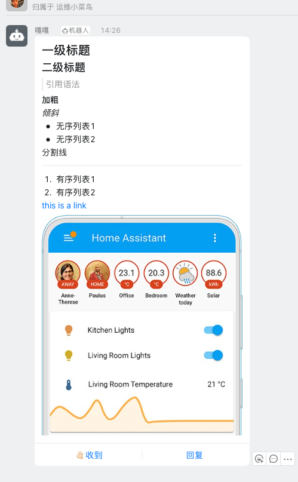

# home-assistant-components
home assistant custom components

本仓库存放一些个人使用的ha 自定义集成

# ddrobot_notify

钉钉群自定义webhook机器人通知集成

配置在 configuration.yaml

    notify:
      - platform: ddrobot_notify
        name: ddrobot             # 实体ID  比如这个出来就是notify.ddrobot
        robot: # 钉钉群自定义机器人有发送频率限制 可以配置多个机器人 发送时随机选择一个机器人 
          - access_token: access_token1
            secret: secret1
          - access_token: access_token2
            secret: secret2
        isatall: true   # 是否圈所有人

目前发送只支持markdown语法

    service: notify.ddrobot
    data:
      title: test
      message: "# 一级标题 \n 
      ## 二级标题 \n 
      > 引用语法 \n\n 
      **加粗**\n\n
      *倾斜*\n
      - 无序列表1 \n
      - 无序列表2 \n\n
      分割线\n\n
      ---\n
      1. 有序列表1 \n
      2. 有序列表2 \n\n
      [this is a link](https://www.home-assistant.io/)\n
      "

markdown 语法既支持url链接又支持图片基本可以满足大部分需求

使用时需要熟悉markdown语法

欢迎各位测试
